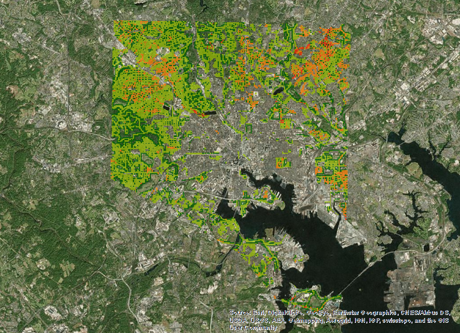

==============================================
English Ivy Ideal Habitat Suitability Analysis
==============================================

-----------
Description
-----------
English Ivy is an exotic invasive plant brought to the US as an ornamental ivy but has aggressively spread
beyond its decorative purpose to choke out native species, create ivy deserts, and damage property and entire ecosystems. 

-------
Purpose
-------
This English Ivy Ideal Habitat Suitability Analysis seeks to identify areas within Baltimore, MD that may be ideal
English Ivy habitats in order to create target areas for invasive removal efforts.

------
Method
------
Software used:
* Arcmap - Spatial Analyst Tools (Reclassify, Euclidean Distance, Fuzzy Membership, Fuzzy Overlay)
* QGIS Desktop 2.8.1
* Python 2.7

Data was collected from a variety of sources to create the necessary surfaces to perform this analysis. These include
the MD state government, USGS, and the Baltimore city government. 

In order to proceed a model of the ideal habitat was created:

Ideal Habitat:

* Within 50ft of edge areas 
* Soil is not extremely wet
* Slightly sunny to shady light
* Surrounded by deciduous trees

Due to the number of data sources and their disparate schemas, normalization was necessary. This process
was automated using Python scripts and Raster reclassification.

A Fuzzy Overlay Analysis was used to discover ideal habitats since the invasive species are not contained by discrete boundaries.
Additionally this method can also highlight areas of varying suitability; providing a spectrum of ideal habitats and target areas.

First an Aspect surface was generated using the 1m DEM. This was then reclassified to highlight shady and slightly sunny areas (North and North East facing).
Next a surface was generated highlighting areas within 50ft of paved roadways using the Euclidean Distance Tool.
After this values representing drainage were calculated from related tables in the STATSGO Soil Data and rasterized, then reclassified.
A surface measuring distance from green spaces was also created using the Euclidean Distance Tool, then reclassified.

The reclassified surfaces were then assigned membership using the Fuzzy Membership tool using the following types:

* Streets: NEAR
* Soils: SMALL
* Aspect: SMALL
* Green Spaces: SMALL

Finally, a Fuzzy Overlay surface was created using the Fuzzy Overlay Tool and the AND overlay type.

-------
Results
-------

Results have not yet been field verified, but an initial observation has proven them to be mostly true. As demonstrated in the data, the most likely 
areas to foster English Ivy are near impervious roadways, near green spaces, in areas with slight exposure to light and soil moisture content.

------------
Data Sources
------------

* MD Imap - Baltimore DEM
* Baltimore City - Boundary, Green Spaces, Roadways
* USDA - Mid Atlantic Soils
Soil Survey Staff, Natural Resources Conservation Service, United States Department of Agriculture. Web Soil Survey. `Available online at http://websoilsurvey.nrcs.usda.gov/`_. Accessed [4/22/2016].

-------
Contact
-------
* Stephanie Helms - Baltimore City Invasive Species Program Coordinator
* Brad Hamson - GIS Analyst/Developer

* stephaniem.helms@gmail.com
* brad.hamson@gmail.com

-------
Licence
-------
GPL v3